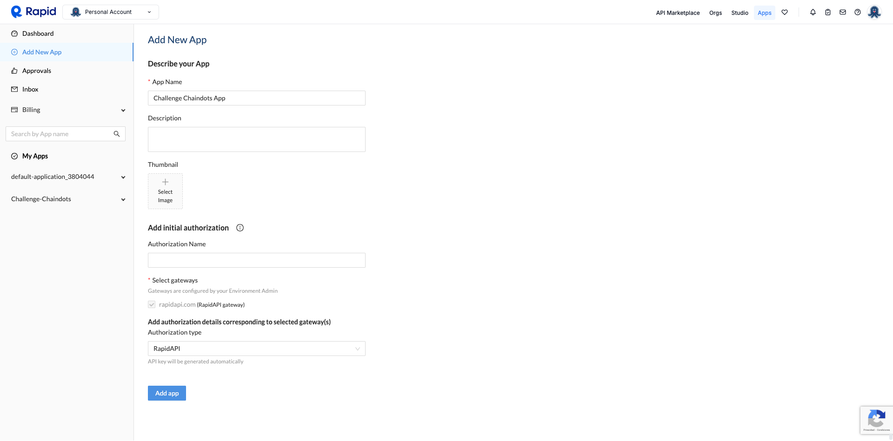
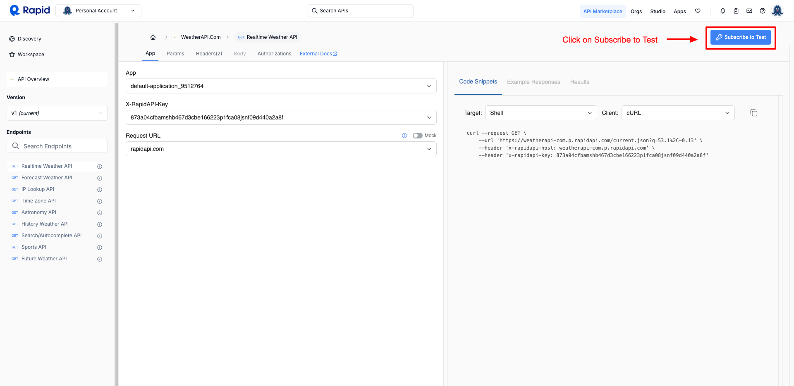
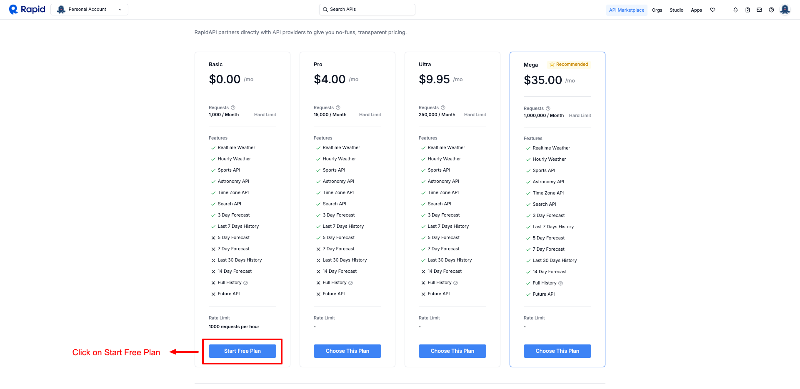
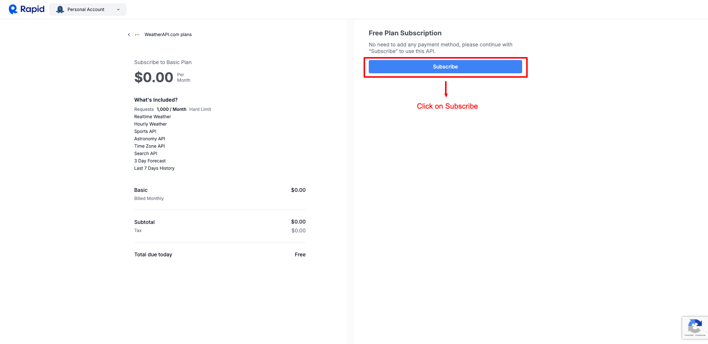
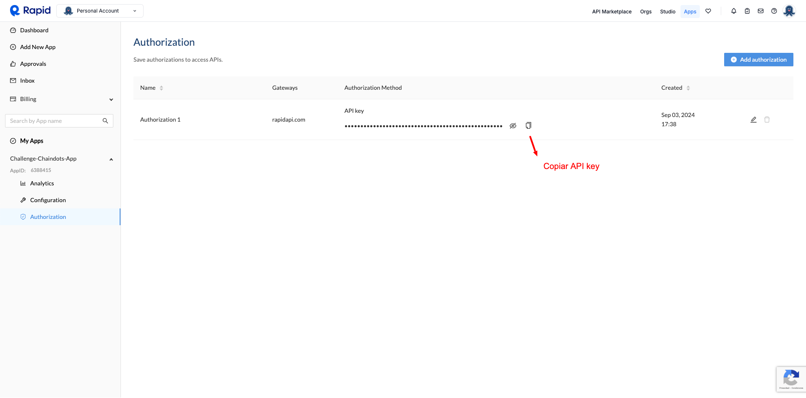

# Code Challenge

## Descripción del challenge

Desarrollar una aplicación de pronóstico del tiempo utilizando ReactJS, que muestre información meteorológica de ciudades alrededor del mundo. La interfaz de usuario debe ser construida con Material-UI y el manejo de estados global debe implementarse con React Context. La información meteorológica se obtendrá consumiendo una API de RapidAPI.

## Requerimientos funcionales

### Página de inicio

Mostrar un campo de búsqueda donde los usuarios puedan escribir el nombre de una ciudad.
Al realizar la búsqueda, mostrar los resultados con la información del clima actual para la ciudad seleccionada. Incluir datos como temperatura, descripción del clima (nublado, soleado, lluvioso, etc.), humedad, velocidad del viento, y un ícono que represente el clima.
Permitir a los usuarios guardar ciudades como favoritas, las cuales se deben persistir entre sesiones de navegación.

### Página de ciudades favoritas

Listar todas las ciudades marcadas como favoritas con información básica del clima.
Proporcionar un acceso rápido a la página de detalles del clima para cada ciudad favorita.

### Página de detalles del clima

Mostrar información detallada del clima para la ciudad seleccionada, incluyendo los datos mostrados en la página de inicio más un pronóstico extendido para los próximos 5 días.

## Requerimientos técnicos

- RRD: Utilizar react-router-dom para el enrutamiento.

- Material-UI: Emplear Material-UI para diseñar los componentes de la interfaz, asegurando que la aplicación sea responsive y visualmente atractiva.

- Manejo de Estados y React Context:Implementar React Context para manejar el estado global de la aplicación, como la lista de ciudades favoritas y los datos del clima.

- Usar el manejo de estados locales para componentes específicos cuando sea necesario.

- Consumo de API:Seleccionar y consumir una API de pronóstico del tiempo de RapidAPI. Documentar el proceso de suscripción a la API y cómo obtener la clave API en el README del proyecto.

## Entregables

- Código fuente del proyecto alojado en un repositorio de GitHub.

- README con instrucciones sobre cómo ejecutar el proyecto localmente, incluyendo cómo configurar la clave API de RapidAPI.

## Extras (Opcionales)

1. Persistencia de Datos: Implementa una solución para persistir los datos de las tareas (puede ser local storage, una API mock, etc.).

2. Autenticación: Implementa un sistema de autenticación básico (puede ser una autenticación falsa) para que los usuarios inicien sesión antes de gestionar las tareas.

3. Demostración en vivo de la aplicación desplegada en Vercel o Netlify, con enlace incluido en el README.

## Evaluación

- Calidad del Código: Legibilidad, uso de buenas prácticas, estructuración y modularización del código.

- Diseño y UX: Cumplimiento de los principios de diseño responsive, estética y experiencia del usuario.

- Implementación Técnica: Correcta utilización de ReactJS, Material-UI, manejo de estados, React Context, y consumo de la API de RapidAPI.

- Testing: Escribe tests unitarios y de integración utilizando Jest y React Testing Library. Asegúrate de cubrir al menos el 80% del código con tests.

- Compleción de Funcionalidades: Implementación completa de los requerimientos funcionales sin errores significativos.

- Documentación: Claridad en las instrucciones de instalación, configuración y uso de la aplicación.

- Este desafío está diseñado para evaluar la habilidad del desarrollador para crear aplicaciones web completas y modernas, integrando APIs externas y gestionando el estado de la aplicación de manera eficiente.

## Solución para el Code Challenge

### Demo


### Implementacion y dependencies

La aplicacion se implemento con [Vite](https://vitejs.dev/) y las dependencias mas importantes que se usaron fueron las siguientes:

- React
- Typescript
- Axios
- React Router Dom
- Material UI
- Json Server

### Configuracion [RapidAPI](https://rapidapi.com/)

1. Crear un usuario en [RapidAPI](https://rapidapi.com/).

2. Una vez logueado en [RapidAPI](https://rapidapi.com/), ingresar a [Apps](https://rapidapi.com/developer/dashboard) para la configuración de la aplicación.

3. Seleccionar desde el menu de la izquierda [Add New App](https://rapidapi.com/developer/apps/new-app) y completar el formulario como se ve en el ejemplo:

   

4. Seleccionar `API Marketplace` y subscribirse al plan `Free` de `WeatherAPI.com` como indica el siguiente ejemplo:

   

   

   

   

5. Una vez creada la app, copiar el API key desde la seccion `Authorizacion` y usarlo en la siguiente seccion cuando se cree el archivo `.env.local`, como se ve en el ejemplo.

   

### Ejecutación de la aplicación localmente

1. Clonar el repositorio.

2. En la raiz del repositorio crear el archivo `.env.local` con el siguiente contenido:

   ```shell
   VITE_API_KEY="XXX"
   VITE_URL_MOCK="http://localhost:8000"
   VITE_URL_BASE="https://weatherapi-com.p.rapidapi.com"
   ```

   #### Nota:

   Reemplazar `XXX` por el valor de la `API key` obtenido en la seccion anterior.

3. Abrir una terminal en el directorio del repositorio y ejecutar el siguiente comando para poder persistir los datos:

   ```
   npm run db
   ```

4. Abrir otra terminal en el directorio del repositorio y ejecutar el siguiente comando para correr la aplicación:

   ```
   npm run dev
   ```

5. Abrir [http://localhost:5173](http://localhost:5173) en el navegador.

6. Disfruta de la aplicación! 🙂

### Aplicacion deplegada

A traves del siguiente link se podrá acceder a la aplicación desplegada en [Vercel](https://vercel.com/).
